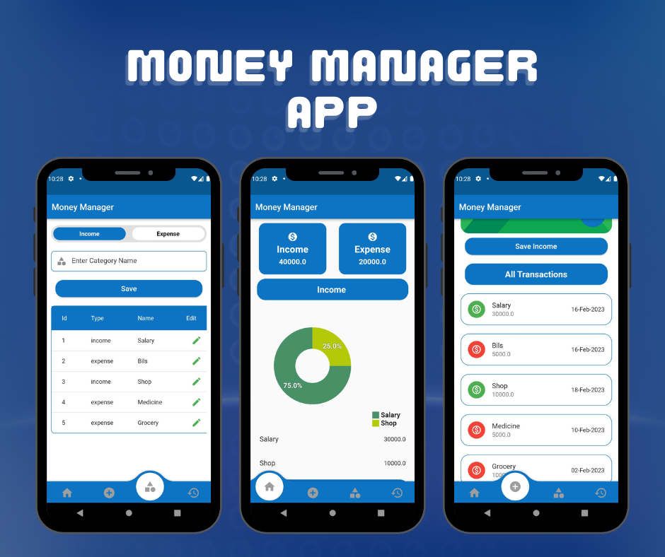

# Money Manager App

A **Flutter**-based money management app that helps users track their income and expenses efficiently. The app uses **SQLite** as the local database for storing transactions, ensuring offline functionality.

---

## 📸 Screenshots

---

## ✨ Features

- 📊 Track income and expenses
- 📅 Filter transactions by date
- 📂 Categorize transactions
- 📉 View total balance and spending trends
- 🖋️ Edit and delete transactions
- 🏆 Simple and intuitive UI
- 📡 Offline support with **SQLite** database

---

## 🛠️ Technologies Used

- **Flutter** (Dart)
- **SQLite** (for local storage)
- **Provider / GetX** (for state management)
- **Material Design** (for UI components)

---

## 📜 License

This project is **open-source** and available.

---

## 🤝 Contributing

Contributions are welcome! If you'd like to improve the app, feel free to **fork** the repository and submit a **pull request**.

---

## 📧 Contact

For any inquiries or suggestions, reach out via:

- **GitHub**: [saira-kanwal](https://github.com/saira-kanwal)
- **Email**: <sairarao046@gmail.com>

---

### ⭐ Don't forget to star the repo if you like this project! ⭐
